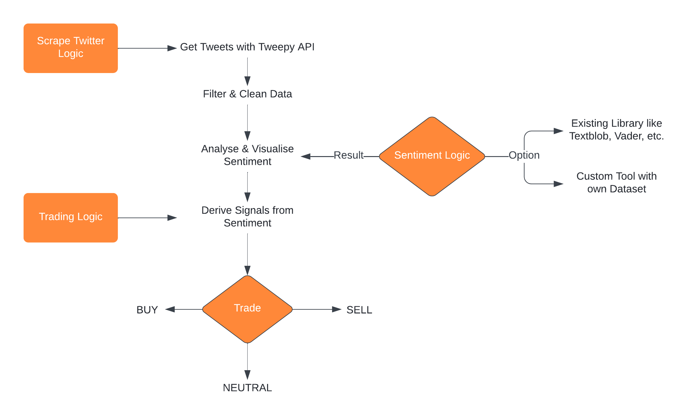

# Introduction 

# Social Signal Sentiment-Based Prediction for Cryptocurrency Trading.

This Project is supposed to cover two topics:
It will analyse specific signals in social networks and their impact on trading digital assets, specifically cryptocurrency. This research will be used in a real-world test with the development of a bot that automatically trades cryptocurrency while considering the analysis of social signals.

## Goal

My goal for this is twofold. As being said by Schoen et al. [1] about social media: “… little is known about their overall potential, limitations and general applicability to different domains.” Chainsulting, a blockchain-company from Flensburg (see Context), is open for publishing my thesis, as it will greatly contribute to a scientific area where not much has been done before. It is obvious, that if an automatic trading bot can increase the revenue this will not likely be published. 
This leads to another reason for this project: Building a reliable database and develop new strategies to get reliable buy and sell signals for successful trading with cryptocurrency. 

### Why social media?

The amount of data social media can offer us is just too big to grasp, but we can use them to our advantage. Studies have already shown that search trends have an impact on the price of stocks [2].
There exists a lot of different social networks (Instagram, Twitter, Facebook, etc.) and after comparing them with respect to their user base, availability of API’s and other factors it will be clear which one is best for our use-case.

To find the right cryptocurrency, the Top 5 Coins based on market capitalisation will be compared in relation to their trading volume, user base, API Access, amount of tweets about the cashtag($btc, $eth, etc.), etc.

If it finds a real-world use-case the costs of trading need to be considered as well. 
As Garcia and Schweitzer [3] are saying in their research: “Trading costs can potentially erode the profitability of trading strategies, especially if they require many movements.” 

After researching a list of keywords the trading bot is supposed to use as signals. Signals are buy, sell and neutral. Neutral meaning that if one position is already bought, the bot should hold the position and not buy a new one or there is no immediate action to be taken. A function to bet against the market (shorting) could also be implemented if the signals lead to that sentiment.

This list of keywords will be in English, because it is the most used language and will lead to the most data. A tool is most likely being used for creating a database, which needs some research here as well.

The keyword list needs to be validated in terms of relevance and impact. 
There is a big room for error here. For example:
How much impact does a tweet from Elon Musk (60M Followers) have in comparison to a tweet from a no-name account with only 10 followers (who could also be a bot) and how is the content of the message being interpreted?

Focussing on one social network, one cryptocurrency and one programming language allows me to get the best results in the time at hand. It will most likely be Twitter as the social network(because of their good documentation), Bitcoin or Ether (the two most used currencies) and Python (good for handling big data and automation). The research will not go into too much detail of mathematic formulas or trading techniques. The result could either be a list about what trades the bot could’ve made and their outcome or a real-world-simulation. It would also be great if the bot can learn and adapt it’s trading (Machine Learning).

## Action Plan
The following numbered list could be a possible action plan and structure for this project:
1. Research
	1. Social Network
		- Building a list of criteria to compare networks
		- Build a keyword list to use as signals
		- Validation of keywords and signals
	2. Cryptocurrency
       	- Analysis the Top 5 currencies 
	3.  Programming Language
       	- Analysis of different languages and frameworks
	4. Summarising all the results to a guideline (optional) 
2. Programming
	- Implementing the server-architecture from Chainsulting
	- Developing the bot
3. Writing 
	- Technical Documentationr
	- Documentation of my Actions
	- Thesis

As can be seen, time will be spent on three things: Research, Programming and Writing.
50% on researching, probably 40% on programming and the last 10% are for writing. Creating the database will connect the two phases of research and programming. The programming part will be split into using the database, building the bot, testing and validating the results. During the whole process everything will be documented, so it will be easier at the end to write everything together.

### Context

This project will find context in the R&D Department of Chainsulting, a blockchain-company based in Flensburg. Like them and most of the software projects, GitHub will be used to store the code.
Contact person will be Yannik Heinze, CEO of Chainsulting. ([Email](y.heinze@chainsulting.de))

	“Chainsulting is a consulting and development company, on the subject of Distributed Ledger Technology (DLT) & Digital Assets. We show ways, opportunities, risks and offer comprehensive solutions. “ [4]

Chainsulting is keen on finding out if the idea behind social signals is working and interested in increasing their revenue and improving their trading methods. 
As mentioned above there are a couple of studies who already analyse the impact of social media on the stock market. 
My thesis can lay a foundation for further studies, so everyone can have a guideline for their individual use-case.
And if the results are useful, Chainsulting may use this bot in their trading desk. Code and Research will be a 100% public.

## My Approach

### Research
My research will include the following
- [Analysis of Top 5 Cryptocurrencies](
- [Analysis of Social Media Platforms](
- [How to get the Sentiment

### Programming

## Abstract
#TODO Put Task, Approach and achieved goals in a few words here 