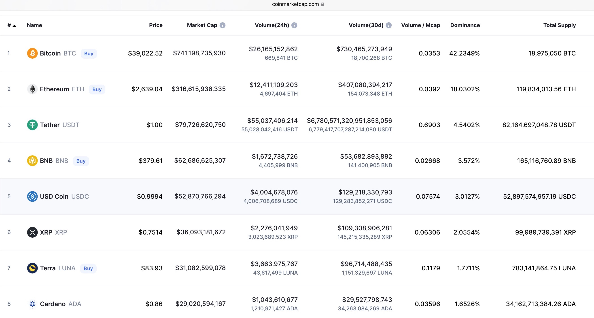
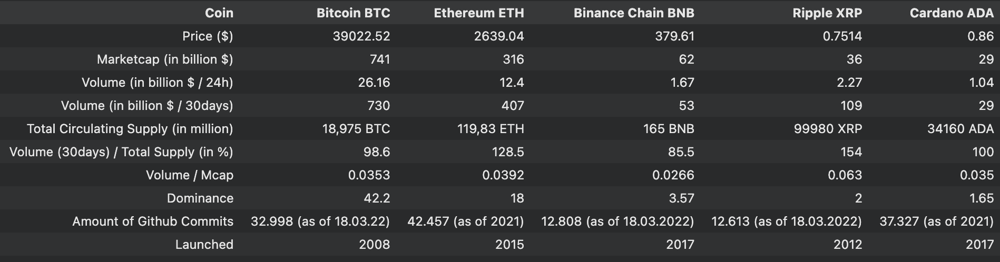
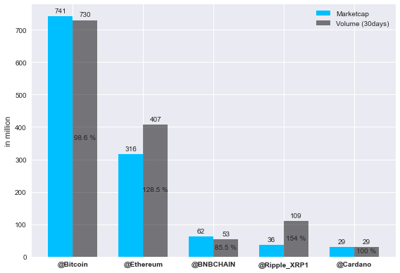
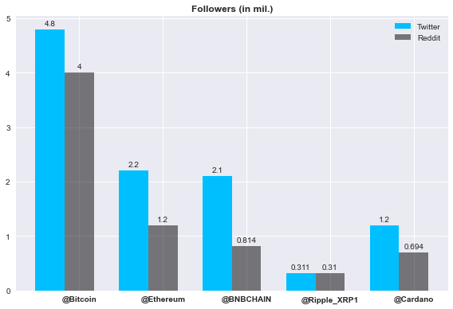

# Research

 

## Coin Comparison
In March 2022, there were a total of 18000 cryptocurrencies. To minimize the number of coins for comparison, it is wise to look at the biggest coins by market capitalisation (see Figure 1). They are the most known and impactful.

##### *Figure 1: Snapshot from the 5th March 2022 from [Coinmarketcap](https://coinmarketcap.com)*
 

Stablecoins like Tether, USD Coin or Terra are not included, since they are pegged to a FIAT-Currency like the US-Dollar. It is totally normal to trade with Currencies or Stablecoins, but you most likely loose to professionals, and you need to use leverage to even get a good arbitrage. In Figure 2 it can be seen, that the Trading-Volume (30days) of Tether is enormously more than the total circulating supply. While this is a good sign for liquidity and trading itself it is not very suitable for our Use-Case. Therefore, we will focus on the Top 5 Cryptocurrencies based on market capitalisation: Bitcoin, Ethereum's Ether, Binance Chain BNB, Ripples XRP and Cardanos ADA.

 

##### *Figure 2: Detailed Coin Comparison*
 

### Marketcap & Volume 
Since Bitcoin is the pioneer and exists for more than 14 years now it is the most dominant Coin with the highest market capitalisation. It stands now at about 740 billion dollars but has already breached 1 trillion dollars in February 2021. Bitcoin reached a trillion marketcap. in only 13 years. The first company to do that, Apple, took **38 years** for that.

Ethereum is chasing Bitcoin and has already reached a dominance of 18% of the market. The Others seem quite small in comparison but when you see that they just exist for 5 years and already accumulated billions it quite impressive. 

 

##### *Figure 3: Market capitalisation and Volume for Top 5 coins*
 

Adding the trading volume for the last 30 days into the comparison we can see that Ethereum and Ripple are being traded the most. At a Volume/Total Supply of 128.5% for Ethereum and 154% for Ripple. 

With Bitcoin and Cardano, nearly 100% of their total supply is being traded in a month. 
The least monthly trading happens with BNB at only 85% of their total supply. 

Crypto in that regard is more similar to FIAT-Currency than to other investments like stocks. 

There is also a very big difference in the maximum Supply of Coins. For Bitcoin, there will never be more than 21 M Bitcoin. Ripple and Cardano have a hard cap as well (100 bil. and 45 bil.) and Binance initially offered 200 billion BNB but conducts a quarterly burning with the goal to have 100 billion left at the end. Ethereum, to the contrary, does not have a maximum Supply. The hard cap and the halving of Mining rewards every four years ensures that Bitcoin is deflationary by design. Ethereum handles this with burning ETH, but can still issue new ETH.

### What does this mean for our trading purpose?
When there is more trading there is more liquidity in the market and therefore orders are fulfilled faster and cheaper. This would mean for Ethereum and Ripple to be a good choice for trading, but since we are not keen on trading very often very fast it really does not really matter which of these big coins we are choosing. 

 

---

 

## Social Media Relevance
The data will be collected from Social Media, and therefore we need to compare the different Social Media Platforms and then comparing the coins on the most suitable platform.

### Social Media Platforms
In July 2022, there are more than 17 social media platforms with at least 300M monthly users:

##### *Figure 4:The worlds' most used social platforms, taken from [datareportal.com](https://datareportal.com/social-media-users)*
 

They are all very different in regard of how they work. Some are focused on video (Youtube, Tik Tok, Instagram), some for communication (Telegram, WeChat, Whatsapp), photos (Instagram, Pinterest) and some for writing (Twitter, Reddit, Quora). We are only interested in analysing and processing text, leaving us with Facebook, Twitter, Reddit and Quora.

Facebook disallows nearly every scraping or collection of data ([Read this](https://www.octoparse.com/blog/5-things-you-need-to-know-before-scraping-data-from-facebook)) and has shown to be a platform where a lot of complaints and hate exists. Moreover, well-known personalities, like Presidents or CEO's, are more likely to be found on Twitter.

Quora does not have a public API and is primarily used as a Q&A-Forum instead of spreading quick and fast opinions.

Reddit is a good choice for gathering sentiment and has been quite popular amongst traders. Especially since it made the headlines when the reddit members of the room r/wallstreetbets with their 4.8M members (2021, 2022: 11.8M members) came together and bought stocks like crazy. 

> "Prompted by the information posted on social media retail investors began buying these so called “meme-stocks” including GameStop, AMC Entertainment, Blackberry, and Nokia. The activity sent their prices soaring, with the GameStop share prices climbing over 1000% in just two weeks." ([Source](https://www.thetradenews.com/the-reddit-revolt-gamestop-and-the-impact-of-social-media-on-institutional-investors/))

But Reddit is also not very good for fast live data and their API and libraries are not very well documented.

Leaving us with our final choice: Twitter

A lot of Users, including well-known Personalities, who are talking about different topics in a somewhat appropriate manner in real-time. Twitter offers a well written Documentation for their API and easy-to-use libraries for Python.

### The Top 5 Coins on Twitter and Reddit
This Snapshot from 14th of March shows how different the Social Media Presence can be.
In spite of being one of the youngest coins in the list, BNB has the second place in terms of total tweets and is third in total followers on Twitter. 

 

##### *Figure 5: Comparison of Coins on Twitter and Reddit*
 

In Terms of Followers on Twitter and Reddit, for obvious reasons Bitcoin is in first place. 
It is very interesting to see that Ripple has a very little following despite being around for 10 years. 

 

##### *Figure 6: Visualisation of Followers*
 

Since there is a lot of volatility and hype in the cryptocurrency world the amount of talk about one cryptocurrency can change in minutes. Twitter can show you the amount of tweets in the last hour when you search for a hashtag or cashtag. For these five Coins the range of tweets can be anything up to 8000 tweets in the last hour. This obviously depends on the timezone (CET /UTC+1). On a random day ( 18.03.2022) the hashtag #xrp was the strongest (6350 tweets in the last hour) and just 5 days later, on the 23rd of March, #btc trended with 7480 tweets in the last hour. At the same time #bnbchain had only 460 tweets in the last hour.

It is also quite random which hash- or cashtag will be trending and there are lots of different synonyms or variations for each Coins. #btc #bitcoin #btcusd is commonly being used to talk about Bitcoin, but this range can expand greatly. 
Especially when the name of the Blockchain, for example Cardano, is different than the name of their underlying Cryptocurrency, which is being called Ada. So, in case of Cardano, there are many more different hash- and cashtags: #cardano #ada $ada #cardanoada #cardanocommunity and since Cardano has one of the most Developers (see the second image -> most Github Commits), there exists a lot of talk about #buildingoncardano or #builtoncardano. All these different synonyms and variations need to be considered and evaluated to get the sentiment about one Cryptocurrency. 

In case of Ethereum, the cashtag $eth is typically being more used than the #eth and is often misspelled but still trending (Etherum instead of Ethereum). As you can see in the following picture, Twitter only shows these hints about the amount of tweets when you search for this exact hashtag and even then you need to be lucky that twitter shows it. Thus, this can’t be really used as a qualified statistic to compare the sentiment about the Coins.

## Focus on Bitcoin
Because there is high volatility in both the crypto market and Twitter, you can't really determine which coin is being talked about the most at any given time. Ripple has the least followers and in total not a lot of talk about it.

Building a modular model in a way that it can retrieve tweets about any coin was a likely goal at first, but since the database storage will be limited, it is wise to primarily concentrate on Bitcoin since it is the one that has started the whole cryptocurrency era and the most followers and talk about it.

 

---

 

## Choosing a programming language
*Python* was the chosen the programming language for this project. Not only had the developer a good amount of experience with it, further more offers Python the needed libraries to analyse and visualise data in a way that allows for rapid prototyping.

 

---

 

<a href="https://github.com/moerv9/sentiment/blob/main/docs/0_Introduction.md"><button onclick="" type="button"  style="border: 2px white solid; background-color: transparent; color:white; border-radius: 8px; padding: 10px;">< Previous Chapter: Introduction</button></a>
<a href="https://github.com/moerv9/sentiment/blob/main/docs/2_Concept.md"><button type="button"  style="float:right; border: 2px white solid; background-color: transparent; color:white; border-radius: 8px; padding: 10px;">Next Chapter: Concept ></button></a>

 