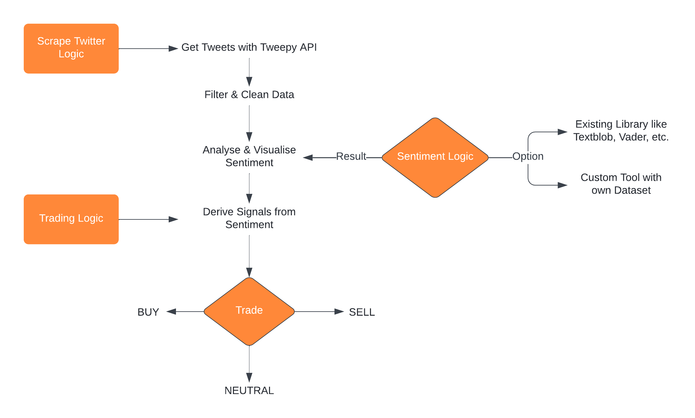

# Concept
## Requirements Analysis

To access the requirements, one normally would use a [stakeholder analysis](9_Appendices.md#s).

Since this project is more like a research project, it is not really intended to be used as a product outside of Chainsulting. Thus, the primary and only stakeholder is one of the CEO's of Chainsulting, Yannik Heinze, who is keen on finding out about the effects of sentiment on trading performance.

In consultation with Mr. Heinze, the requirements for this project have been set beforehand.

The requirements are structured as functional and non-functional with three categories:
- *Must-Have*-Requirements are essential for the system to work at all.
- *Should-Have*-Requirements are improving the system, but are not necessary for the system to run.
- *Optional* Requirements can improve the final product, but not at all necessary.

 

---

 

## Functional Requirements [FR]

### *Must-Have*
| **Nr.** | **Description**                                           |
|---------|-----------------------------------------------------------|
| [FR 10] | The system delivers real-time tweets from Twitter         |
| [FR 20] | The system delivers a sentiment for each tweet            |
| [FR 30] | The system builds trade-signals based on sentiment |
| [FR 40] | The system trades based on these signals                  |
|

 

### *Should-Have*
| **Nr.** | **Description**                                           |
|---------|-----------------------------------------------------------|
| [FR 50] | The system filters tweets       |
| [FR 60] | The system visualises metrics of tweets, sentiment and trades|
| [FR 70] | The system stores the data in a database                            |
| [FR 80] | The system can run in the background                      |
|

 

### *Optional*
| **Nr.** | **Description**                                           |
|---------|-----------------------------------------------------------|
| [FR 90] | The system uses different trading strategies at the same time|
| [FR 100] | The system uses Machine-Learning to improve the strategy|
|

 

---

 

## Non-Functional Requirements [NFR]
### *Must-Have*
| **Nr.** | **Description**                                           |
|---------|-----------------------------------------------------------|
| [NFR 10]| The project must contain research on used cryptocurrencies and social-media platform    |
| [NFR 20]| The project will be published open-sourced on GitHub      |
|

 

---

 

## Steps for Development Phase
From the above requirements analysis, a flow diagram was derived to simplify and visualise the order of steps that are needed to be taken in the development phase. This helped to split the available time into phases for each part in this diagram. It was basically the key to time-management of this project.
The orange bigger box are the parent steps, in which the smaller steps take place.

 

##### *Figure 7: Flow Diagram for Development Phase*
 

 

---

 

## Development Environment

 

### Code Editor

The code editor used was Visual Studio Code with their tremendous amount of extensions.
Particular helpful extensions were the [Jupyter](https://marketplace.visualstudio.com/items?itemName=ms-toolsai.jupyter) Notebook, the [TabNine](https://marketplace.visualstudio.com/items?itemName=TabNine.tabnine-vscode) AI supported Autocomplete and the [LTeX](https://marketplace.visualstudio.com/items?itemName=valentjn.vscode-ltex) LanguageTool that checked grammar and spell Markdown files. This way it was possible to directly write the documentation inside VSCode.

 

### Environment Setup

To ensure version control for used python libraries the package and environment management system [Conda](https://docs.conda.io/en/latest/) was used.

With conda environments it is possible to work with defined python and package versions.

Setting up an environment is easy:

1. Install conda with `pip install conda`
2. Create the environment with `conda create --name myenv`
3. See if environment was created `conda env list`
4. Activate environment with `conda activate myenv`

To create an environment from an existing `requirements.txt` file add this to the second step:

`conda create --name myenv --file requirements.txt`

The following packages were used:

- pandas
- matplotlib
- sentiment
- streamlit
- wordcloud
- numpy
- openpyxl
- regex==2022.3.2
- pyOpenSSL
- demoji
- python-dateutil
- python-dotenv
- tweepy
- SQLAlchemy
- vaderSentiment
- psycopg2-binary
- streamlit_autorefresh
- boto
- schedule
- postgres
- python-binance
- python-kucoin

Export to requirements.txt or requirements.yml with

- `conda env export > environment.yml`

- `pip freeze > requirements.txt`

 

### Local Development

#### **Tweepy Stream and local Export**

1. Activate the conda environment with required packages (see above)
2. Get your own API-Keys from Twitter API and Kucoin Sandbox and add them to .env-file
3. Set up a Postgres Database and add DB_URL to .env 
4. Edit runner.py : 
    - Uncomment line 48 for local export
    - Either add the keywords for the coins in the last line:    
Runner(['btc','ada','eth']))  
      or Uncomment lines 66 - 72  

5. run script via terminal:  
        `python3 runner.py -k "btc,eth,ada" -i 5`

#### **Streamlit**

    1. cd streamlit
    2. streamlit run 01_💬_Tweet-Sentiment.py
    3. open http://localhost:8501

 

---

 

## Folder-Structure

 

| **main - Folder** |                            |
|-------------------|------------------------------------------|
| config.py         | File to get the Environment-Variables     |
| Procfile          | A Heroku file for starting the processes |
| docs              | Contains the ordered Documentation       |

 

| **sentiment - Folder** |   |
|------------------------|---|
| filter.py              | Functions to filter the tweets by checking for blacklisted words, duplicates and unnecessary symbols  |
| keywords.py            | Class to build a keyword list for coins  |
| listener.py            | Class to listen and filter tweets     |
| runner.py              | Main Class. Called in [Procfile](../Procfile) and starts Listener with Keywords  |
| trade.py               | Functions for Trading. Called every hour in Heroku Scheduler.    |
| Logs-Folder            | All Logs (Heroku, Tweepy, Excel, Json)

 

| **sentiment/database - Folder**           |                                                                           |
|-------------|---------------------------------------------------------------------------|
| database.py | SQL-Alchemy Connection with Heroku database                               |
| exporter.py | Export Local Tweets to Json/Excel                                         |
| Trade.py    | Trade Class to declare the Format and Type of each Column in the Database |
| Tweet.py    | Tweet Class to declare Format and Type of each Column in the Database     |

 

| **streamlit - Folder**      |   |
|-------------------------|---|
| 01_💬_Tweet-Sentiment.py | Main File to visualise all the data from tweets, sentiment and trades with Streamlit (*01...* is streamlit-notation for multiple pages) |
| financial_data.py       | Functions to get the data from Heroku Database, get prices from Binance and for building Signals  |
| streamlit_data.py       | Functions to edit the data from the databases: Splitting the DataFrame, calculate average and convert to signals.  |
| visualise.py            | Functions to visualise the price chart and words.   |

 

---

 

<a href="https://github.com/moerv9/sentiment/blob/main/docs/1_Research.md"><button onclick="" type="button"  style="border: 2px white solid; background-color: transparent; color:white; border-radius: 8px; padding: 10px;">< Previous Chapter: Research</button></a>
<a href="https://github.com/moerv9/sentiment/blob/main/docs/3_Data_Acquisition.md"><button type="button"  style="float:right; border: 2px white solid; background-color: transparent; color:white; border-radius: 8px; padding: 10px;">Next Chapter: Data Acquisition ></button></a>

 