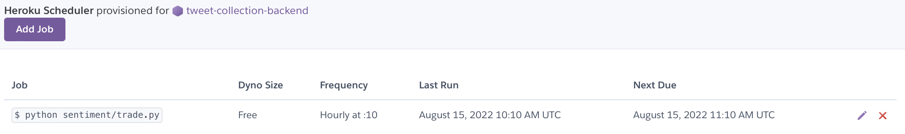
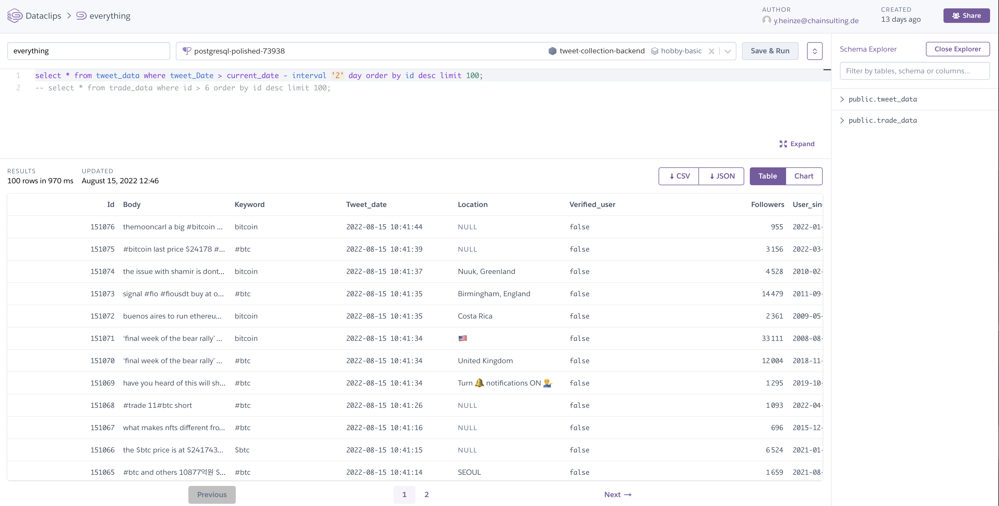

# Backend
</br>

## Reason for Heroku

Tweepy uses two ways of searching for tweets: Searching through the history or listening to real-time tweets.
One approach would be to schedule a task, p.e. for every hour, that searches the history of tweets and does the trading afterwards. However, after looking closer into the Documentation, it was discovered that the search service with the Twitter API doesn't show all available tweets. This would lead to incomplete data, which would deflect the strategy and therefore wasn't an option.

When listening to real-time tweets, the python script needs to run the whole time in the background ([FR 80]). It is no option to only run it on the local machine when it is intended to run for days or weeks. When the laptop is closed, the script stops running.

That is where cloud platforms as services come in handy. Today, most of the SaaS-products run in some sort of cloud since it is not very desirable for smaller companies to run and maintain servers for their clients when other bigger corporations such as Google, Amazon or Microsoft offer better, more scalable and cheaper services.

For this project, [Heroku](https://www.heroku.com/) was used as the cloud provider, because it works well with Python, has a free tier available and an easy-to-use Postgres Database Add-On ([FR 70]) and GitHub Continuous Integration.

Heroku works with containerization: It automatically detects a change in the GitHub Repository and starts a new Deployment. Because this did not always work, it is still possible to manually deploy in the Heroku Dashboard or with the Heroku CLI.

Heroku will then package the code and dependencies and runs it in lightweight, scalable and isolated containers, which are called *dynos*.
In the free tier you have free 550 dynos each month and every time a web service is called, or a script (worker) is run a dyno is consumed. 

Using Heroku allows to run the script in the background, store data in a database and schedule trades.

</br>

---

</br>

## Setting up Heroku
Creating an App in the Heroku Dashboard and initializing it with our codebase in VSCode was the first thing to do. The easiest way to do this is by connecting the Heroku App with the GitHub Repository. But since we were using the Heroku Account from Chainsulting and are not able to access their GitHub account, it was not possible to use GitHub Continuous Integration. Instead, manually deploy every change of code from the terminal with `git push heroku main`.

Secondly, the [Heroku Postgres](https://devcenter.heroku.com/articles/heroku-postgresql) Add-On was added and credentials were stored inside the Config Variables of the Heroku Dashboard.

Our connection with the Database from our python code is established with psycopg2 and SQLAlchemy.
Psycopg2 reads the data and SQLAlchemy is responsible for creating a session and then commits the data to the database.


The following example shows how to connect to the database and read the data into a Pandas DataFrame by using a simple SQL Statement.
```
import os
import psycopg2

DATABASE_URL = os.environ['DATABASE_URL']

conn = psycopg2.connect(DATABASE_URL, sslmode='require')

query = f"select * from tweet_data order by id desc limit 10;"

df = pd.read_sql(query, conn)

```

Heroku uses a so called Procfile to start the processes. This meant the worker script for listening to tweets and adding to the database is added to this file:
```
worker: python3 sentiment/runner.py
```

The Heroku Scheduler Add-On is used to execute the trading script every hour. It checks if there are trades for a past timeframe and either buys, sells or does nothing if there is a trade already.
More on the trading part [here](6_Trading.md).

</br>


##### *Figure 9: Scheduler Add-On on Heroku*
</br>


</br>

---

<br>

## Checking the Databases


Heroku Dataclips offers to run SQL queries and view the output directly in the Browser. It was a very valuable tool to check quickly if a SQL Statement is executed successfully on the real database and if everything works smoothly in the production phase. 

</br>


##### *Figure 10: Dataclip to view the Tweet database with SQL queries*
</br>


</br>

---

</br>

## Challenges and Solutions
Heroku was an essential tool for this project, but revealed a lot of challenges during configuration. Below are a few challenges and how there were overcome.

### No such Procfile
The first problem appeared directly after initializing it with Git and deploying the first time with GitHub Continuous Integration in my own GitHub repository.
Although, the Procfile was in the main directory, Heroku could not find it.
Weirdly enough, it was fixed after deploying it manually and setting the correct python buildpacks via the Heroku CLI with the following commands:

```
heroku buildpacks:set heroku/python`
git push heroku main
```


### Connection with Postgres Database
The Postgres Database revealed many problems.
You can connect to the Database either via Database URL or via Username, Password and Hostname. Since the latter worked perfectly when connecting to other databases before, this was the first approach, but the password authentication always failed.
After a long while of debugging and going through StackOverflow, nothing worked.
At random, the connection way was switched to the Database URL and after fixing two further problems the connection was finally established.
The URL just needed to be changed from `"postgres://..."`to `"postgresql://.."` and the connection required SSL, which was easily set by `heroku config:set PGSSLMODE=require``

### Postgres Row Limit of 10000 
The Free Hobby Plan for Heroku Postgres Database has a limit of 10000 rows, and it got filled very quickly. The database was filled in a few hours.
But nothing happened. A week passed, and the database was filling up until I got an email from Heroku: 

</br>

 

##### *Figure 11: Email from Heroku: Database Row Limit reached*
</br>


The Heroku Database got filled such quickly because the system was collecting Tweets about Bitcoin **and** Cardano.
It would be very interesting to compare different coins side by side, but it made sense to only look at Bitcoin after this point to gather more Tweets.
In the end this was a waste of time because Chainsulting was so kind and upgraded the Heroku Database Plan to a row limit of 10M, which should last for about a month of Tweets.
Of course, this can be improved by better filters and periodically deleting tweets from the database.
Unfortunately, when the Database is full, Heroku revokes *Writing-Privileges*, which makes it even impossible to delete single rows via a dataclip. Leaving the only solution to clear the whole database, which has been done a few times before the upgrade.

</br>

---

</br>

<div style="display: inline;" >
<a href="https://github.com/moerv9/sentiment/blob/main/docs/3_Data_Acquisition.md"><button onclick="" type="button"  style="border: 2px white solid; background-color: transparent; color:white; border-radius: 8px; padding: 10px;">< Previous Chapter: Data Acquisition</button></a>
<a href="https://github.com/moerv9/sentiment/blob/main/docs/5_Sentiment.md"><button type="button"  style="float:right; border: 2px white solid; background-color: transparent; color:white; border-radius: 8px; padding: 10px;">Next Chapter: Sentiment ></button></a>
</div>

</br>

