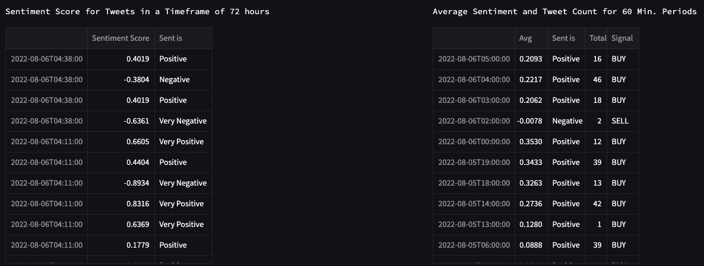
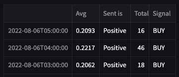
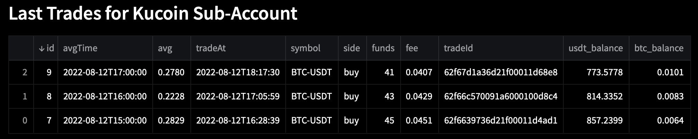
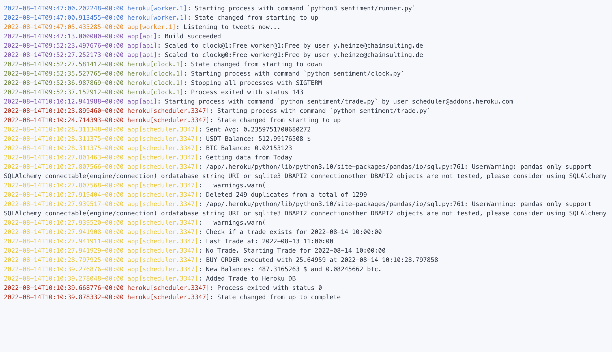

# Trading

## Choosing an API
There are a lot of exchanges for trading cryptocurrencies. Which all have pros and so leads to a comparison of APIs with respect to this project's use case. It is important that the API has a good and easy documentation and an extensive python library/wrapper.

The following table shows the full comparison of five cryptocurrency API's, which was made using this [Article](https://www.abstractapi.com/guides/best-crypto-currency-apis):


| **Platform**                                  | [Binance](https://www.binance.com/en/binance-api)                                                                                                                                                       | [CoinBase](https://www.coinbase.com/cloud)                                            | [Kucoin](https://www.kucoin.com/api)                                                                           | [Coinmarketcap](https://coinmarketcap.com/api/)                                                                               | [Kraken](https://docs.kraken.com/rest/)                                                                                                                                                                                      |
|-----------------------------------------------|------------------------------------------------------------------------------------------------------------------------------------------------------------------------------------------------------------|------------------------------------------------------------------------------------------|-------------------------------------------------------------------------------------------------------------------|----------------------------------------------------------------------------------------------------------------------------------|---------------------------------------------------------------------------------------------------------------------------------------------------------------------------------------------------------------------------------|
| **Pros**                                      | Directly sell and buy with the API,</br>Connector to diff. Languages (python, Ruby),</br>Commission when using BNB coin, </br> 1200 free Requests per Minute, </br> Binance has one of the biggest markets | API can be used as an Exchange or Wallet,</br>Real-Time Notifications for Account Events | Many currencies(>200),</br>Telegram Group for Support,</br>1800 Free Requests per MinuteCrypto Lending available  | Good integration in many languages(python,node.js,php),</br>11 endpoints in real time for free                                   | Good python integration and code examples directly in documentation                                                                                                                                                             |
| **Cons**                                      | There have been outages in the past. </br>When exceeding the transaction limits, the IP will be temporarily banned                                                                                         | Only etc, eth, btc cash, litecoin, </br>Only 180 Requests per Minute                     | Performance issues (payments & trades hold back)                                                                  | No historical Data,</br>Pay 29$/month for 1month historical data</br>60 Requests per Minute</br>Not all REST API Calls available | ID Verification needed,</br>No test environment,</br>Trading Volume and Trade Calls depending on account level (starter, intermediate, pro): When 15 requests are reached, a decay of -0.33/sec is applied and you need to wait |
| **Historical Data**                           | Yes                                                                                                                                                                                                        | Yes                                                                                      | Yes                                                                                                               | No                                                                                                                               | Yes                                                                                                                                                                                                                             |
| **Fees**                                   | 0.1%, but when using BNB can be lowered to 0.075%                                                                                                                                                          | 1%                                                                                       | 3-5%, when buying with FIAT</br>0.1% for crypto, 0.08% when buying with Kucoin Token                                               | not found any data                                                                                                               | 0.9% fee for any stablecoins</br>1.5% fee for any other crypto or FX pair                                                                                                                                                       |
| **Rating of Documentation**                   | Very good                                                                                                                                                                                                  | Good                                                                                     | Very good                                                                                                         | Okay                                                                                                                             | Very good                                                                                                                                                                                                                       |
| **Availability of Python Libraries/Wrappers** | Very good and updated.</br>https://github.com/sammchardy/python-binancehttps://github.com/binance/binance-connector-python                                                                                 | Last updated 8 years ago.</br>https://github.com/resy/coinbase_python33                  | Very good and updated.</br>https://github.com/sammchardy/python-kucoinhttps://github.com/Kucoin/kucoin-python-sdk | Not really detailed.</br>https://github.com/rsz44/python-coinmarketcap                                                           | Not updated recently. </br>https://github.com/veox/python3-krakenex                                                                                                                                                             |
|


</br>

When it came to the decision which API to use, it was quite easy to filter out the ones that weren't suitable. 
CoinBase was the first to drop because it has only five coins and no currently active python libraries available. 

Coinmarketcap was also not very intriguing because it has limited Endpoints and no historical Data. Paying 29$ a month for 1 month of historical data didn't seem worth it when others offer it for free. Their python wrapper was also not very detailed.

I personally use Kraken, so the ID Verification wouldn't even be a problem, but they do not offer a test/sandbox environment. Their way of working with request limits is also very different to the others and seemed to be a limiting factor.
But the biggest problem with Kraken was that there is no recently updated python wrapper available. 

Kucoin offers many currencies and the most free requests per minute, but reported some performance issues, which lead to the decision to Binance. At least at first. 

Binance has one of the biggest markets with the highest liquidity and small fees.
They have a very good documentation and an updated python wrapper with lots of tutorials.
The only thing to keep in mind is the potential ban of my IP when the request limit is reached.

### The Problem with Binance 
The verification process was long and even required to send some Bitcoin to the Binance Wallet. Afterwards, it was possible to create the API-Keys, which are needed to connect the Client with Binance.  Getting live price data from the Binance API was working perfectly, so everything seemed fine. Visualisations of Charts were made to have a better overview and make a small simulation to test the strategy (see [below](#papertrading)).

Then it was time to implement the trading strategy into the Binance sandbox and the problem appeared. The Sandbox Testnet didn't accept the API-Keys and even after a while of debugging the error, it wouldn't work, leaving us with no choice but to drop Binance for Kucoin. Setting up Kucoin was faster and their sandbox worked perfectly.

</br>

---
</br>

## Kucoin API
After registration you need to go through a verification process. Typically, this is a call with a person that verifies your identity or uploading a photo of a personal ID-Card, but Kucoin only needs verification via Google Authenticator. 

After that the API-Keys could be generated. These Keys are needed to connect and verify the Client with the API.

The [*python-kucoin*](https://github.com/sammchardy/python-kucoin/) wrapper helps with the Kucoin API, so there is no need to manually connect with the API via HTTP-Requests.

Acquiring data from the Kucoin API is fairly easy. Getting the latest price for BTCUSDT, the account balance, and making a market order are all done with a few lines of code. As can be seen below in the output, the current USDT Balance in the account is over 48k USDT. Kucoin offers every account a virtual amount of 250k USDT (~11 BTC) to trade with in their sandbox environment. They also offer Sub-Accounts, which is great to test a strategy for a specific amount of money, without risking to lose it all, when something goes wrong. This meant, papertrading could be performed and evaluated.

```
from kucoin.client import Client as kucoinClient

kClient = kucoinClient(kconf.KUCOIN_KEY, kconf.KUCOIN_SECRET,kconf.KUCOIN_PASS,sandbox=True)

tickers = kClient.get_ticker(symbol="BTC-USDT")
btc_price = tickers["bestAsk"]
print(f"Current BTC Price: {btc_price}")

accounts = kClient.get_accounts(account_type="trade")
usdt_balance = accounts[0]["balance"] #for Main Client
btc_balance = accounts[1]["balance"] #for Main client
btc_in_usdt = float(btc_balance) * float(btc_price)

print(f"USDT Balance: {usdt_balance} $")
print(f"BTC Balance: {btc_balance} ({btc_in_usdt} $)")

# Make a Market Order for 5% of the current USDT Balance
funds = re.match(r'\d+.\d{3}', str(usdt_balance*0.05)).group(0)
order = kClient.create_market_order('BTC-USDT', kClient.SIDE_BUY, funds = funds)
```

**Output:**
> Current BTC Price: 22420.7
>
> USDT Balance: 48942.07811348 $
>
> BTC Balance: 0.00194057 (43.508937799 $)

---

</br>

## Strategy

Building the strategy to make signals when a trade (buy or sell) should be executed, was a real challenge. There are hundreds of different strategies on different technical indicators, but now the buy or sell signal should be based on the sentiment of tweets on Twitter ([FR 30]).

At first, the idea was to calculate the average of sentiment for a particular time period and if this average reaches a certain threshold, a trade should be executed.

In the left table in the image below you see the Timestamp, Sentiment Score and the corresponding meaning for *each tweet*.



##### *Figure 12: Sentiment for a single tweet on the left, Average Sentiment and counted Tweets for a timeperiod of 1h*
</br>


The right table shows the grouped and counted tweets for intervals of 60 min. Afterwards, the average sentiment is calculated and converted into a *Buy* or *Sell* Signal.
It can be seen that there isn't a lot of tweets and some timestamps are missing. This was an error from SQL-Alchemy, which lead to the state of not committing the current 
Database-Session and thus leading to missing timestamps. This is fixed in the final version, but was kept here to correspond to the below chart.

The sentiment score for single tweets are all very different, but the average will naturally move towards neutral sentiment (0.0).
This shift would have been even more if all the neutral tweets had not been removed beforehand.

It would have been easy to just define the buy signal when the average sentiment is positive and a sell signal when the average sentiment is negative. 
But this would mean a lot of buy signals for the above example and since the database is not quite big enough to see if this average is only positive at the moment or if the calculation just tends to be a little above neutral. The bigger the time intervals, the more tweets and the bigger the shift towards neutral. 
This is why the threshold is set to 0.2.

</br>

> An average sentiment above 0.2 means *Buy*, below 0.2 means *Sell*.

</br>

---

</br> 

## Papertrading  
The image below shows the sentiment and bitcoin price from August 5th till August 6th. If the sentiment is above 0.2 (positive or very positive) it is marked as a buy signal in the chart (green triangle).
Since this looked promising it was implemented to real-time Papertrading in the Kucoin Sandbox ([FR 40]).

</br>


##### *Figure 13: Charts for Bitcoin Price and Average Sentiment with corresponding signals*
</br>


</br>
The [LiveTrade-Class](#TODO: trade.py) works as follows:
A function collects all the Data for the single tweets and stores them in a pandas DataFrame. This is neded to delete the duplicates with the following methods:

</br>

```
duplicates = list(
    df.index[
        df.duplicated(
            subset=["Tweet"], keep=False
        )
    ]
)

df.drop_duplicates(
    subset=["Tweet"], keep=False, inplace=True
    )
```
</br>
Afterwards, the neutral tweets are filtered and the rest are counted and the mean/avg is calculated for a resampled interval of 1h. This means all the timestamps from 1h (p.e. from 16:00 - 17:00) are grouped and a function is applied to all of them. This function could be to summarize, count or calculate the mean/avg. 

```
df = df[df["Sentiment Score"] != 0.0]

count_tweets = df.resample(f"1H").count()

mean_df = df.resample(f"1H").mean().sort_index(ascending=False)
```
</br>

These two series get concatenated together to have one table:

</br>



##### *Figure 14: Last three time periods with average, total tweets and signal*
</br>


And these last three timestamps are important for the trading. The first row is showing the actual timestamp. So at the time this picture was taken it was somewhere between 05:00 and 06:00. Since the tweets are collected live and every few seconds this row will be updated frequently and the avg and total tweets will change. 

This is why the second row will be selected as the trading decision. Firstly, it will be checked if a trade was already made for this timestamp.
Then, if the signal indicates buy, a market order will be created with 5% of the available USDT Balance (after a check, if there are any funds available).

A sell order will sell a quarter of the current bitcoin holdings.

At last, some metrics from the trade are uploaded into a separate table on Heroku for a better overview of the trades and later calculation of current PNL (Profit and Loss).
An excerpt from this table is shown below. It contains the sentiment average and the time period, as well as information about the trade itself. The last balances are actually the balances after the trade was made. So, it is possible, to look back at all the balances without gaps. 

</br>



##### *Figure 15: Last Trades with Kucoin Sub-Account*
</br>


</br>

---

</br>

## Looking at the trades


Figure 16 shows the Heroku Logs. At first, the runner is started, that listens to the tweets and adds them to the database. When you see the line `Listening to tweets now...`, you know, everything is working properly.

</br>


##### *Figure 16: Logs from Heroku on scheduled trades*
</br>


As explained in the Backend-Section, the scheduler is executing the trading script every hour.

The sentiment average is shown and the Balances before and after the trade.
It also says if a trade already exists and then either starts a new trade or does nothing.

The Heroku logs were an essential part of the development-phase, since they allowed for a good way of debugging. Usually, no *`print`*-statements are left in the final code, when it's entering the production phase. However, Heroku seems to only print the `print`-statements rather than from the logging-library, which is otherwise used. 
Therefore, a few print statements are left in the final code. 

</br>

---

</br>

<div style="display: inline;" >
<a href="https://github.com/moerv9/sentiment/blob/main/docs/5_Sentiment.md"><button onclick="" type="button"  style="border: 2px white solid; background-color: transparent; color:white; border-radius: 8px; padding: 10px;">< Previous Chapter: Sentiment</button></a>
<a href=https://github.com/moerv9/sentiment/blob/main/docs/7_Visualisation.md"><button type="button"  style="float:right; border: 2px white solid; background-color: transparent; color:white; border-radius: 8px; padding: 10px;">Next Chapter: Visualisation ></button></a>
</div>

</br>
