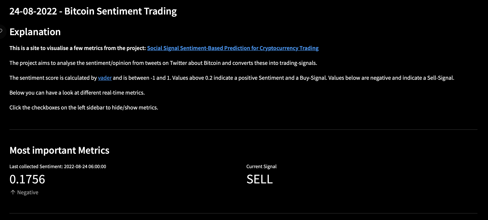
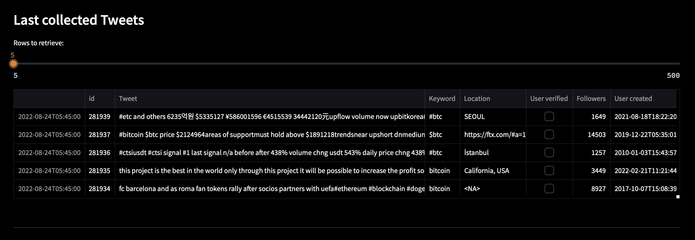
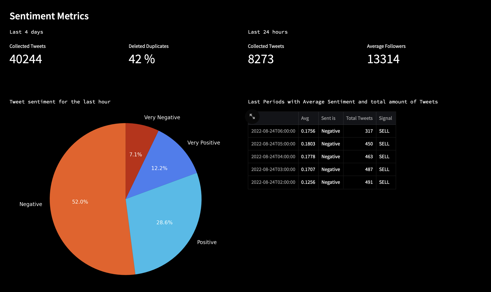
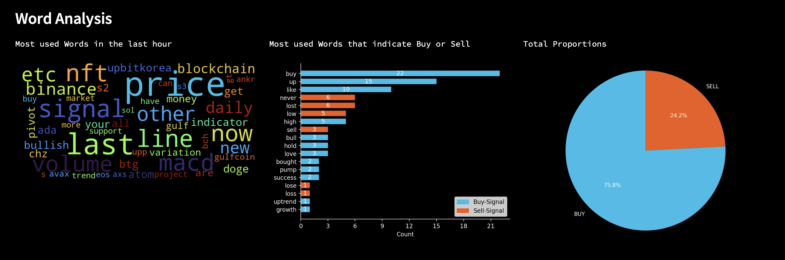
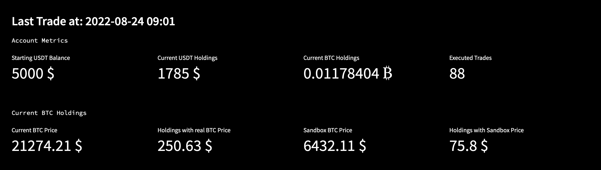
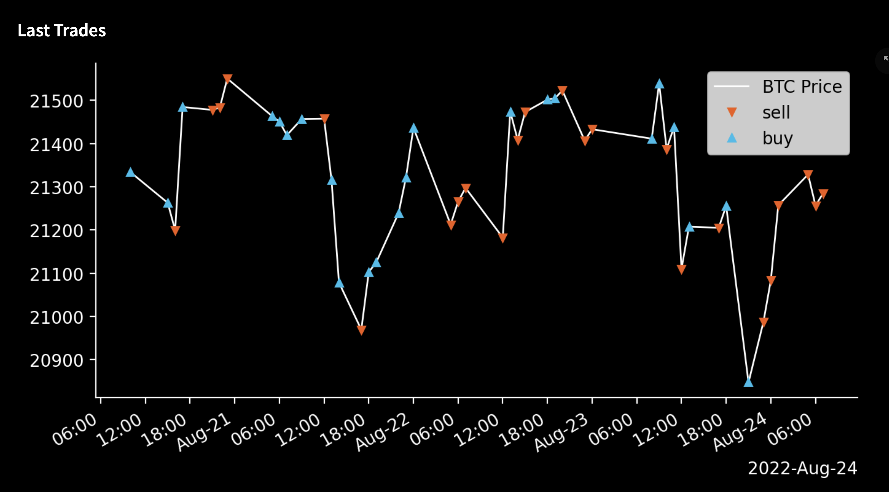
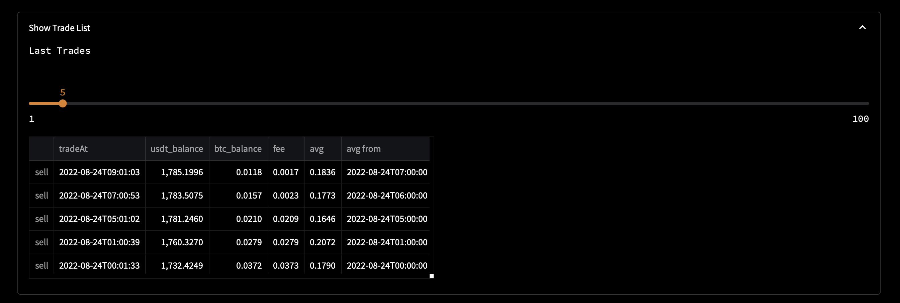

# Visualisation with Streamlit

When scripts are running in the background and acting on their own, a lot of work will never be seen.
Since all the tweet and trade data are stored in a database and the sentiment analysis and price charts can be visualised in plots and diagrams, it was specified in the requirements ([FR 60]).

[Streamlit](https://streamlit.io) is an open-source Framework for building simple and interactive Machine-Learning and Data Science Web-Apps. It was perfect for this project, because it contained all the features for charts and dataframes and was easy to implement and therefore allowed rapid prototyping. 

Actually, Streamlit and Jupyter Notebooks were used to test the code before it entered Heroku, because each execution on Heroku consumed dynos and obviously increased the row count in the database. The jupyter notebooks can be found in this [folder](./jupyter_notebooks/), but are not used in this documentation and therefore a bit messy.

In this project, [Pandas](https://pandas.pydata.org) was used for data analysis and [Matplotlib](https://matplotlib.org) to visualise the data. They both work seamlessly with streamlit.

In the following section are explanations for the single parts that have been visualised on a Website as stated in [FR 60].

This site is hosted at streamlit and if it is working correctly, the real-time current sentiment and trading data should be seen [there](https://moerv9-sentiment-streamlit01--tweet-sentiment-streamlit--cf9fs0.streamlitapp.com/).
However, since they won't host it forever and will shut it down eventually, a screenshot of the site was taken at 24th August 2022 and is used to explain everything below. 

A video was made to explain the whole visualisation in total. (The video is also in the [visualisation](./img/visualisation/) folder)

##### *Figure 23: Visualisation of tweet, sentiment and trading metrics*
 

 

---

 

## Final Visualisation

The site starts by explaining what a sentiment is and shows the `last collected Sentiment` and the `correspending Signal`. The site is structured in a way the whole project was planned. First came the collection of tweets, followed by the sentiment analysis and lastly the trading part.

##### *Figure 24: Explanation and most important Metrics*
 
 

### Last collected Tweets

With a slider, the rows of single tweets to retrieve from the database can be adapted (Figure 25). It is basically the same table as in the Data-Acquisition-Section, but now in real-time. It was very good to work with streamlit during the whole development phase to have a look at the current status of the heroku database without needing to go through the whole heroku dashboard (which takes quite a few steps to look at the dataclip of the database).

##### *Figure 25: Last collected tweets with some metrics*
 

 

### Sentiment Metrics

Figure 26 shows some metrics about sentiment. At the date of collection (24-08-2022), a total of 40k Tweets were collected in the past four days and 8273 in the past 24h. The average follower count was 13.314, which is okay, considered only accounts under 500 followers are filtered. It means there are quite a lot of accounts with a high follower account, speaking for a high quality of tweets.

Over a few days, the average of deleted duplicates has always been around 45%.

> Nearly half of all tweets are duplicates! Presumably by bots.

This is a very high number and show how many bots are tweeting and trying to influence the opinion about Bitcoin. It has been the most eye-opening fact from this project.
The cake diagram on the left shows the sentiment for the last timeframe. It corresponds to the first line from the table on the right. Neutral tweets have been removed as being explained in [Sentiment](5_Sentiment.md#more-filters).
The table shows the last five time periods with the calculated sentiment average and total tweets. This was the base for the trading-part.

##### *Figure 26: Sentiment Metrics*
 
 

### Word Analysis

The wordcloud on the left visualises the usage and frequency of words in all the tweets from the last time period. 

In the middle, the usage of words which signal a buy- or sell-signal is shown. 
It stems from the following Subdivision of Words:

| BUY-Signal       | SELL-Signal          |
|------------------|----------------------|
| - buy & bought   | - sell               |
| - bullish & bull | - down               |
| - high           | - bearish            |
| - pump           | - sold               |
| - growth         | - never              |
| - up & uptrend   | - bad                |
| - revolution     | - low                |
| - hold           | - dump               |
| - love           | - decline            |
| - trust          | - downfall & downtrend |
| - success        | - decay              |
| - hodl           | - recession          |
| - like           | - short              |
| - profit         | - hate               |
| - gain           | - #short             |
| - #pump          | - #dump              |
| - long           | - loss & lost & lose |

 

It is very interesting to see that most of the words at this time were positive and signaling a buy trade in comparison to the overall negative sentiment of all tweets. 

It would be a good idea to build a strategy based on the usage of these words and compare it to the overall sentiment-strategy. Out of time shortage, this couldn't be implemented during this project. 

##### *Figure 27: Word Metrics*
 
 

### Trading

For the trading part the first thing to have a look at are the most important metrics.
The trading was started on the 16th August 2022 and after 8 days, a total of 90 trades were executed. The current holdings stood at 1785 $ USDT and the Bitcoin Balance was 0.0117 ₿ Bitcoin. 

As being said in [Challenges](6_Trading.md#different-sandbox-prices) in the Trading-Section, the sandbox price is different from the real price of bitcoin. It was attempted to find a factor, but the sandbox price has unusual and incomprehensible price movements. This meant, the results could not be evaluated that easily. At the time of writing (24th August, 9:46) the holdings in bitcoin equalled 250$, which would lead to a total loss of 2965 $. 

##### *Figure 28: Kucoin Account Metrics*
 

Figure 28 shows the last trades, visualised with the corresponding real-time bitcoin price. Working with Matplotlib to visualise the data has been an essential part for understanding the collected data and make predictions. 

A valuable statement can be made with this chart:

> The sentiment about bitcoin on twitter is as volatile as the bitcoin price.

 

Buying at the lowest price and buying at the highest is the ultimate goal of trading. Since this is achieved very rarely and near impossible to persevere, fast trading looks for indicators to buy or sell quickly. Long-Term Investors on the other hand normally ride out short-time losses. 

The strategy here was very simple and did not really take into account if a position of BTC is already held or if a sell-trade is being executed at a very bad price. The last part of the chart is a great example for this. The Buy-Trade happened on the 23rd August at 20:00 at the lowest price and then went only up afterwards, but the sentiment was always negative, so every hour a portion was sold. The system could wait for the first price drop after an uptrend and then sell. Same for the other way around. This would hold positions longer and lead to a better cost-average-effect.

This could be one way to improve the strategy. As can be seen below, a lot of trades are made during the day, because the system is scheduled to act every hour. If there wasn't that much price movement in Bitcoin, the trading times would be spread wider apart. For example, every 6 or even 12 hours. But this would mean that the calculated average moves more to *neutral*, which would decrease the significance of the score.

##### *Figure 29: Chart of last trades*
 

Figure 30 shows the list of all trades with some more metrics.
The first column shows if the trade was a buy or a sell. 
"TradeAt", "Avg" and "AvgFrom" are self-explanatory.
The balances are taken **after** the trade. 
The fee is very important if it comes to a more detailed calculation of Profit-And-Loss, as being said by Garcia and Schweitzer:

> “Trading costs can potentially erode the profitability of trading strategies, especially if they require many movements." [3]

At this point and after nearly `90` trades, the total fees are about 10$, which is neglectable. 

 

##### *Figure 30: Table of last trades*
 

Summing up, there is a lot of improvement for different strategies to trade cryptocurrency based on the sentiment, but the foundation of all the technological necessities has been set.

 

---

 

<a href="https://github.com/moerv9/sentiment/blob/main/docs/6_Trading.md"><button onclick="" type="button"  style="border: 2px white solid; background-color: transparent; color:white; border-radius: 8px; padding: 10px;">< Previous Chapter: Trading</button></a>
<a href="https://github.com/moerv9/sentiment/blob/main/docs/8_Conclusion.md"><button type="button"  style="float:right; border: 2px white solid; background-color: transparent; color:white; border-radius: 8px; padding: 10px;">Next Chapter: Conclusion ></button></a>

 