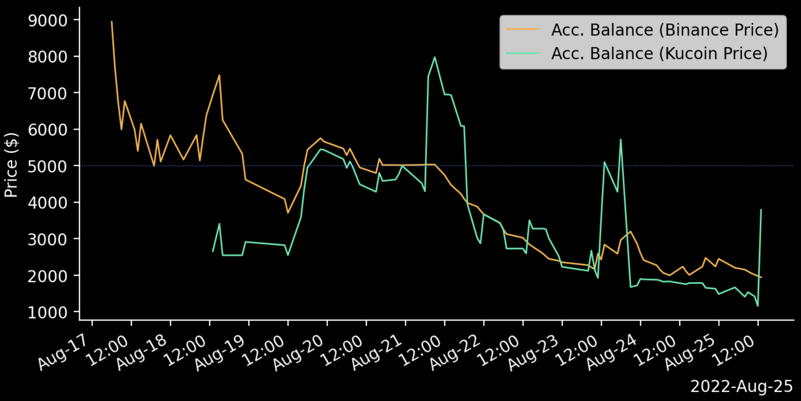
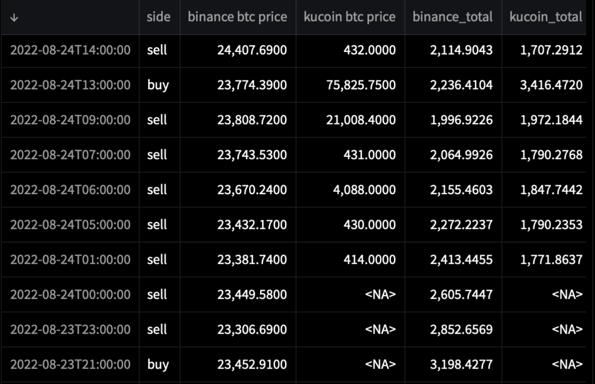

# Conclusion 

## Requirements

The requirements from the [concept](2_Concept.md#requirements-analysis)-phase are needed to be checked for fulfillment.
It can be said, that all the *Must-Have* and *Should-Have*-Requirements have been achieved. 

The system listens and filters real-time tweets, builds signals from a calculated sentiment and trades based on these signals.
It can run in the background and stores all important data inside a database and lastly visualises all insightful data on a website.

The use of different strategies and Machine-Learning to improve the strategy couldn't be achieved. This was accepted, because there were only *optional* requirements.

The non-functional requirements have been successfully achieved by
[researching](1_Research.md) cryptocurrencies and social-media platforms and publishing this project on GitHub.

 

---

 

## Results 
The system started the automated trading based on sentiment at the 16th of August 2022 with a balance of 5000$ USDT. At this day, the 27th August, the account Balance is below 700 $ and the Bitcoin Balance is 0.004 which would equal 800$ when converting with the real-time Bitcoin Price.
As can be seen in figure 31 below, the account balances didn't really work as a great overview. The Account Balance with the real Bitcoin Price from Binance lead to a way to high balance at first and Kucoin couldn't get any data for the trading times. Even after contacting the Kucoin Support, it is not clear why the Bitcoin Price in the Sandbox has such unusual behaviour. The figure 32 shows this in the column *"kucoin btc price"*. Within a day, the price moved from `431$` to `75.825$`. This doesn't make any sense.
This has been the limiting factor when interpreting the results.

However, after a small time of profits at the 20th August, the chart shows a clear downward trend for both lines. As being said before, a rather simple strategy was chosen to primarily test if everything works on the technical side and not to make big gains. Although, seeing that this type of trading is easily implemented and can run in the background, moving this system a level up by improving the filters and implementing different strategies, it would lead to better results. 

There are many more strategies that could have been tested, and a few are described below in the Outlook-Section.

##### *Figure 32: Chart of Account Balance with Binance and Kucoin Prices for Bitcoin*

 

##### *Figure 33: Binance and Kucoin Prices for Bitcoin (in $) at Timestamps of Trades*

 

---

 

## Outlook

### Better Strategies

Because of the short time of this project, further strategies or improvements of the sentiment strategy were not implemented.
A very simple improvement would be a check, if a position of BTC is already held or if a sell-trade is being executed at a very bad price.

A few other strategies were:
- Looking for single words for "bullish" or "bearish" sentiment (like the [word analysis](./7_Visualisation.md#word-analysis))
- Using technical indicators like the 20-SMA (20 day single moving average) in combination with sentiment analysis
- Calculating the weighted average instead of a normal average
- Ratio of positive / negative sentiment crossing a particular threshold

Since there are way too many Cryptocurrencies and no way to have an overview over all of them, a good approach for trading with sentiment could be to listen to plenty of coins at the same time and trade the coin that gets the most hype and afterwards sell everything when the hype stops. 

Building a modular system was actually the first approach and the infrastructure to listen to multiple tweets is basically set.
The factor that prevented the final implementation of this modular system was the row limit of the database. The Twitter API also has a limit for keywords, but this wasn't reached.

Since the first approach to clean old entries in the database were a failure, the system was simplified to only listen to Tweets about Bitcoin.

The insights about Social Media have been very profound. Having nearly half of all the tweets being duplicates was a big surprise, as well as the fact, that many tweets are just nonsense (and I cannot see a reason for this).

 

---

 

## Learnings

It has been an awesome and interesting project from the start and I have learned a lot of things:

- Building a whole python project from start to finish by myself
- Running scripts in the background on cloud provider Heroku
- Building and adding to a real-time database with Postgres
- Building a strategy for trading and testing it in real-time inside a sandbox from a crypto broker
- Data Analysis with Pandas
- Visualisation with Matplotlib

There are a few things, I would do different next time:

I shouldn't have spent that much time figuring out a beautiful documentation platform ([mkdocs](https://www.mkdocs.org) and [gitbook](https://www.gitbook.com)), that wasn't used in the end, but rather look for a simpler solution that is easily implemented. 

Some improvements in time-management are also needed. I would make a better plan with SMART goals that are not too hard to reach, so I would see a lot of progress very fast.

I shouldn't have spent that much time on visualisation when most functionality wasn't done yet.

However, this project has sparked my interest in data analysis and visualisation in such a fun way, that I can picture myself in this career path.

For this, I really want to thank [Yannik Heinze](y.heinze@chainsulting.de) and [Robert Manzke](https://www.fh-kiel.de/fachbereiche/informatik-und-elektrotechnik/wir-ueber-uns/lehre/professuren-und-lehrkraefte-fuer-besondere-aufgaben-lfba/manzke-prof-dr-robert/) for giving me the opportunity to work on this project and hopefully be of use for further projects.

 

---

 

<a href="https://github.com/moerv9/sentiment/blob/main/docs/7_Visualisation.md"><button onclick="" type="button"  style="border: 2px white solid; background-color: transparent; color:white; border-radius: 8px; padding: 10px;">< Previous Chapter: Visualisation</button></a>
<a href="https://github.com/moerv9/sentiment/blob/main/docs/9_Appendices.md"><button type="button"  style="float:right; border: 2px white solid; background-color: transparent; color:white; border-radius: 8px; padding: 10px;">Next Chapter: Appendices ></button></a>

 