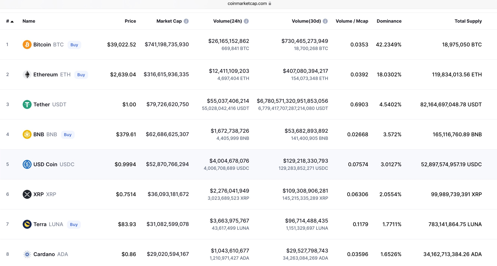

# Coin Analysis

The image above is a snapshot from 5th of March 2022. It is the Base for my comparison. From this I've put together a new table with some added metrics (image below). I will compare the Top 5 Coins, excluding Stablecoins like Tether, USD Coin or Terra since they are pegged to a FIAT Currency like the US-Dollar. It is totally normal to trade with Currencies or Stablecoins but you most likely loose to professionals, and you need to use leverage to even get a good arbitrage. You can see in the following picture that the Trading-Volume (30days) of Tether is enormously more than the total circulating supply. While this is a good sign for liquidity and trading itself it is not very suitable for our Use-Case. Therefore we will focus on the Top 5 Cryptocurrencies based on Marketcapitalisation: Bitcoin, Ethereum's Ether, Binance Chain BNB, Ripples XRP and Cardanos ADA.

### Marketcap & Volume 
Since Bitcoin is the pioneer and exists for more than 14 years now it is the most dominant Coin with the highest Marketcapitalisation. It stands now at about 740 billion dollars but has already breached 1 trillion dollars in February 2021. Bitcoin reached a trillion Marketcap. in only 13 years. The first company to do that, Apple, took **38 years** for that.

Ethereum is chasing Bitcoin and has already reached a dominance of 18% of the market. The Others seem quite small in comparison but when you see that they just exist for 5 years and already accumulated billions it quite impressive. 

Adding the trading volume for the last 30 days into the comparison we can see that Ethereum and Ripple are being traded the most. At a Volume/Total Supply of 128.5% for Ethereum and 154% for Ripple. 

With Bitcoin and Cardano, nearly 100% of their total supply is being traded in a month. 
The least monthly trading happens with BNB at only 85% of their total supply. 

Crypto in that regard is more similar to FIAT-Currency than to other investments like stocks. 

There is also a very big difference in the maximum Supply of Coins. For Bitcoin, there will never be more than 21 mil. Bitcoin. Ripple and Cardano have a hard cap as well (100 bil. and 45 bil.) and Binance initially offered 200 billion BNB but conducts a quarterly burning with the goal to have 100 billion left at the end. Ethereum, to the contrary, does not have a maximum Supply. The hard cap and the halving of Mining rewards every four years ensures that Bitcoin is deflationary by design. Ethereum handles this with burning ETH, but can still issue new ETH.

### What does this mean for our trading purpose?
When there is more trading there is more liquidity in the market and therefore orders are fulfilled faster and cheaper. 

# Social Media Relevance 
### A Snapshot from 14th of March 

    

Since there is a lot of volatility and hype in the cryptocurrency world the amount of talk about one cryptocurrency can change in minutes. Twitter can show you the amount of tweets in the last hour when you search for a hashtag or cashtag. For these five Coins the range of tweets can be anything up to 8000 tweets in the last hour. This obviously depends on the timezone (CET /UTC+1). On a random day ( 18.03.2022) the hashtag #xrp was the strongest (6350 tweets in the last hour) and just 5 days later, on the 23rd of March, #btc trended with 7480 tweets in the last hour. At the same time #bnbchain had only 460 tweets in the last hour.

It is also quite random which hash- or cashtag will be trending and there are lots of different synonyms or variations for each Coins. #btc #bitcoin #btcusd is commonly being used to talk about Bitcoin but this range can expand greatly. 
Especially when the name of the Blockchain, for example Cardano, is different than the name of their underlying Cryptocurrency, which is being called Ada. So, in case of Cardano, there are many more different hash- and cashtags: #cardano #ada $ada #cardanoada #cardanocommunity and since Cardano has one of the most Developers there exists a lot of talk about #buildingoncardano or #builtoncardano. All these different synonyms and variations need to be considered and evaluated to get the sentiment about one Cryptocurrency. 

In case of Ethereum, the cashtag $eth is typically being more used than the #eth and is often misspelled but still trending (Etherum instead of Ethereum). As you can see in the following picture, twitter only shows these hints about the amount of tweets when you search for this exact hashtag and even then you need to be lucky that twitter shows it. Thus, this can’t be really used as a qualified statistic to compare the sentiment about the Coins.
