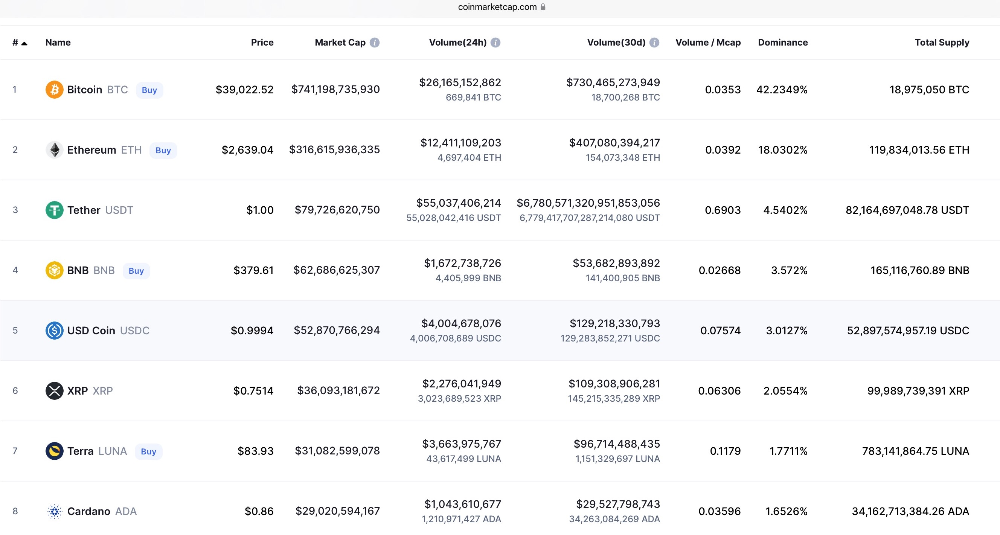
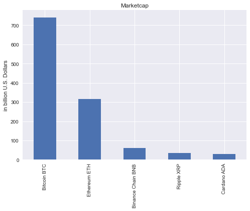
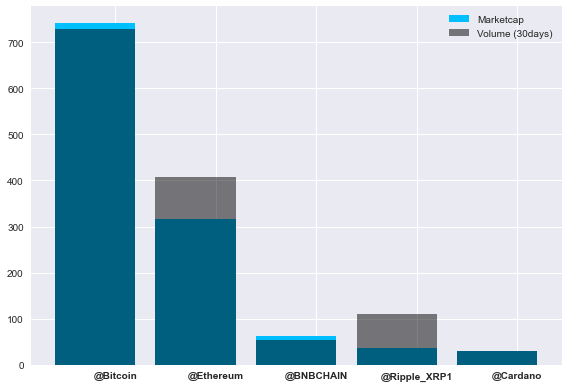
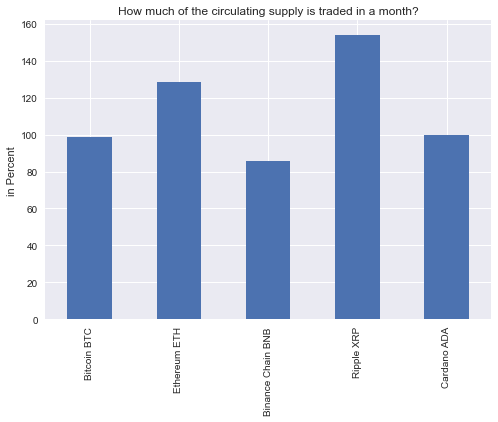
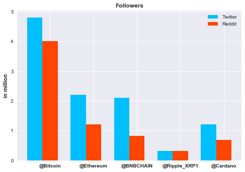

# Cryptocurrency Analysis



## Choosing which Coins to analyse

I want to talk about why I choose these Coins and these particular metrics.
Stablecoins like Tether, USD Coin or Terra are not included in this Analysic since they are pegged to a FIAT Currency like the US-Dollar. It is totally normal to trade with Currencies or Stablecoins but you most likely loose to professionals and you need to use leverage to even get a good arbitrage. You can see in the following picture that the Trading-Volume (30days) of Tether is enormously more than the total circulating supply. While this is a good sign for liquidity and trading itself it is not very suitable for our Use-Case. Therefore we will focus on the Top 5 Cryptocurrencies based on Marketcapitalisation: Bitcoin, Ethereum's Ether, Binance Chain BNB, Ripples XRP and Cardanos ADA.

I've made an Excel-Table to analyse different metrics about these Coins. Since Bitcoin is the pioneer and exists for more than 14 years now it is the most dominant Coin with the highest Marketcapitalisation. It stands now at about 740 billion $ but has already breached 1 trillion $ in February of 2021. Bitcoin reached a trillion Marketcap. in only 13 years. The first company to do that, Apple, took **38 years** for that.

Ethereum is chasing Bitcoin and has already reached a dominance of 18% of the market. The Others seem quite small in comparison but when you see that they just exist for 5 years and already accumulated billions it quite impressive. 

# Show Excel Table 


```python
import pandas as pd

excel_path = "../datasets/coins_comparison.xlsx"
df_sheet1 = pd.read_excel(excel_path,sheet_name=0)
pd.set_option("display.max.columns", None)
df_sheet1.head(10)
```


<div>
<style scoped>
    .dataframe tbody tr th:only-of-type {
        vertical-align: middle;
    }

    .dataframe tbody tr th {
        vertical-align: top;
    }

    .dataframe thead th {
        text-align: right;
    }
</style>
<table border="1" class="dataframe">
  <thead>
    <tr style="text-align: right;">
      <th></th>
      <th>Coin</th>
      <th>Bitcoin BTC</th>
      <th>Ethereum ETH</th>
      <th>Binance Chain BNB</th>
      <th>Ripple XRP</th>
      <th>Cardano ADA</th>
    </tr>
  </thead>
  <tbody>
    <tr>
      <th>0</th>
      <td>Price ($)</td>
      <td>39022.52</td>
      <td>2639.04</td>
      <td>379.61</td>
      <td>0.7514</td>
      <td>0.86</td>
    </tr>
    <tr>
      <th>1</th>
      <td>Marketcap (in billion $)</td>
      <td>741</td>
      <td>316</td>
      <td>62</td>
      <td>36</td>
      <td>29</td>
    </tr>
    <tr>
      <th>2</th>
      <td>Volume (in billion $ / 24h)</td>
      <td>26.16</td>
      <td>12.4</td>
      <td>1.67</td>
      <td>2.27</td>
      <td>1.04</td>
    </tr>
    <tr>
      <th>3</th>
      <td>Volume (in billion $ / 30days)</td>
      <td>730</td>
      <td>407</td>
      <td>53</td>
      <td>109</td>
      <td>29</td>
    </tr>
    <tr>
      <th>4</th>
      <td>Total Circulating Supply (in million)</td>
      <td>18,975 BTC</td>
      <td>119,83 ETH</td>
      <td>165 BNB</td>
      <td>99980 XRP</td>
      <td>34160 ADA</td>
    </tr>
    <tr>
      <th>5</th>
      <td>Volume (30days) / Total Supply (in %)</td>
      <td>98.6</td>
      <td>128.5</td>
      <td>85.5</td>
      <td>154</td>
      <td>100</td>
    </tr>
    <tr>
      <th>6</th>
      <td>Volume / Mcap</td>
      <td>0.0353</td>
      <td>0.0392</td>
      <td>0.0266</td>
      <td>0.063</td>
      <td>0.035</td>
    </tr>
    <tr>
      <th>7</th>
      <td>Dominance</td>
      <td>42.2</td>
      <td>18</td>
      <td>3.57</td>
      <td>2</td>
      <td>1.65</td>
    </tr>
    <tr>
      <th>8</th>
      <td>Amount of Github Commits</td>
      <td>32.998 (as of 18.03.22)</td>
      <td>42.457 (as of 2021)</td>
      <td>12.808 (as of 18.03.2022)</td>
      <td>12.613 (as of 18.03.2022)</td>
      <td>37.327 (as of 2021)</td>
    </tr>
    <tr>
      <th>9</th>
      <td>Launched</td>
      <td>2008</td>
      <td>2015</td>
      <td>2017</td>
      <td>2012</td>
      <td>2017</td>
    </tr>
  </tbody>
</table>
</div>


## Visualise the data

## Marketcap & Volume


```python
import matplotlib.pyplot as plt

plt.style.use('seaborn')
plt.title("Marketcap")
plt.ylabel("in billion U.S. Dollars")
df_sheet1.iloc[1][1:].plot(kind="bar")
plt.show()
```


    

    


```python
import numpy as np

y1 = df_sheet1.iloc[1][1:]
y2 = df_sheet1.iloc[3][1:]
x1 = np.arange(len(df_sheet1.columns.values.tolist()[1:]))
plt.bar(x1,y1, color="deepskyblue", label="Marketcap")
plt.bar(x1,y2, color="black", label="Volume (30days)", alpha=0.5)
plt.xticks([r + 0.2 for r in range(len(x1))],
        ['@Bitcoin', '@Ethereum', '@BNBCHAIN', '@Ripple_XRP1', '@Cardano'], fontweight="bold")
plt.tight_layout()
plt.legend()
plt.show()
```


    

    


# Volume (30 days) / Total Circulating Supply
Why is this interesting?
As you can see in the following diagram, the total circulating supply differs a lot. While the first three Coins are in the millions, XRP and ADA are in the Billions. But not only that. There is also a very big difference in the maximum Supply of Coins. For Bitcoin, there will never be more thant 21 mio. Bitcoins. Ripple and Cardano have a hard cap aswell (100 bil. and 45 bil.) and Binance initially offered 200 billion BNB but conducts a quarterly burning with the goal to have 100 billion left at the end. Ethereum, to the contrary, does not have a maximum Supply. The hard cap and the halving of Mining rewards every four years ensures that Bitcoin is deflationary by design. Ethereum handles this with burning ETH, but can still issue new ETH.

Now that we know that for the most of these four coins, new coins can be mined, let's see how much of the total circulating supply is being traded in a month:


```python
plt.style.use('seaborn')
plt.title("How much of the circulating supply is traded in a month?")
plt.ylabel("in Percent")
df_sheet1.iloc[5][1:].plot(kind="bar")
plt.show()
```


    

    


It can be seen that BNB is traded at around 85% of the total circulating supply in a month while XRP is trading 154% of the total supply in a month. That's massive. This shows that Cryptocurrency is more similar to FIAT-Currency than to other investments like stocks. 

### What does this mean for our trading purpose?
When there is more trading there is more liquidity in the market and therefore orders are fulfilled faster and cheaper. 

# Social Media Relevance 
### A Snapshot from 14th of March 


```python
# Reading the second sheet
df_sheet2 = pd.read_excel(excel_path,sheet_name=1)
pd.set_option("display.max.colwidth", None)
df_sheet2.head(10)
```


<div>
<style scoped>
    .dataframe tbody tr th:only-of-type {
        vertical-align: middle;
    }

    .dataframe tbody tr th {
        vertical-align: top;
    }

    .dataframe thead th {
        text-align: right;
    }
</style>
<table border="1" class="dataframe">
  <thead>
    <tr style="text-align: right;">
      <th></th>
      <th>Twitter Handle</th>
      <th>@Bitcoin</th>
      <th>@ethereum</th>
      <th>@BNBCHAIN</th>
      <th>@Ripple_XRP1</th>
      <th>@Cardano</th>
    </tr>
  </thead>
  <tbody>
    <tr>
      <th>0</th>
      <td>Twitter Followers (in million)</td>
      <td>4.8</td>
      <td>2.2</td>
      <td>2.100</td>
      <td>0.311</td>
      <td>1.2</td>
    </tr>
    <tr>
      <th>1</th>
      <td>Amount of Tweets from their Twitter Acc.</td>
      <td>23600.0</td>
      <td>3273.0</td>
      <td>6238.000</td>
      <td>5722.000</td>
      <td>4853</td>
    </tr>
    <tr>
      <th>2</th>
      <td>Tweets in the last hour about their hashtag (18.03.2022)</td>
      <td>2330.0</td>
      <td>2390.0</td>
      <td>3320.000</td>
      <td>6350.000</td>
      <td>1020</td>
    </tr>
    <tr>
      <th>3</th>
      <td>Reddit Members (in million)</td>
      <td>4.0</td>
      <td>1.2</td>
      <td>0.814</td>
      <td>0.310</td>
      <td>0.694</td>
    </tr>
  </tbody>
</table>
</div>


```python
import numpy as np

# Getting the data from the Dataframe
y1 = df_sheet2.iloc[0][1:] #1 Row: Twitter Followers
y2 = df_sheet2.iloc[3][1:] #4 Row: Reddit Members/Followers
x1 = np.arange(len(df_sheet2.columns.values.tolist()[1:]))
barWidth=0.35
x2 = [x + barWidth for x in x1]

# Set the args for the bar-diagram
plt.bar(x1, y1, color="deepskyblue", label="Twitter", width=barWidth)
plt.bar(x2 ,y2, color="orangered", label="Reddit", width=barWidth)

# Styling the diagram
plt.style.use('seaborn')
plt.title("Followers", fontweight="bold")
plt.ylabel("in million", fontweight="bold")
plt.xticks([r + barWidth for r in range(len(x1))],
        ['@Bitcoin', '@Ethereum', '@BNBCHAIN', '@Ripple_XRP1', '@Cardano'], fontweight="bold")
plt.legend()

plt.show()
```


    

    


Since there is a lot of volatility and hype in the cryptocurrency world the amount of talk about one cryptocurrency can change in minutes. Twitter can show you the amount of tweets in the last hour when you search for a hashtag or cashtag. For these five Coins the range of tweets can be anything up to 8000 tweets in the last hour. This obviously depends on the timezone (CET /UTC+1). On a random day ( 18.03.2022) the hashtag #xrp was the strongest (6350 tweets in the last hour) and just 5 days later, on the 23rd of March, #btc trended with 7480 tweets in the last hour. At the same time #bnbchain had only 460 tweets in the last hour.

It is also quite random which hash- or cashtag will be trending and there are lots of different synonyms or variations for each Coins. #btc #bitcoin #btcusd is commonly being used to talk about Bitcoin but this range can expand greatly. 
Especially when the name of the Blockchain, for example Cardano, is different than the name of their underlying Cryptocurrency, which is being called Ada. So, in case of Cardano, there are many more different hash- and cashtags: #cardano #ada $ada #cardanoada #cardanocommunity and since Cardano has one of the most Developers there exists a lot of talk about #buildingoncardano or #builtoncardano. All these different synonyms and variations need to be considered and evaluated to get the sentiment about one Cryptocurrency. 

In case of Ethereum, the cashtag $eth is typically being more used than the #eth and is often misspelled but still trending (Etherum instead of Ethereum). As you can see in the following picture, twitter only shows these hints about the amount of tweets when you search for this exact hashtag and even then you need to be lucky that twitter shows it. Thus, this can’t be really used as a qualified statistic to compare the sentiment about the Coins.
